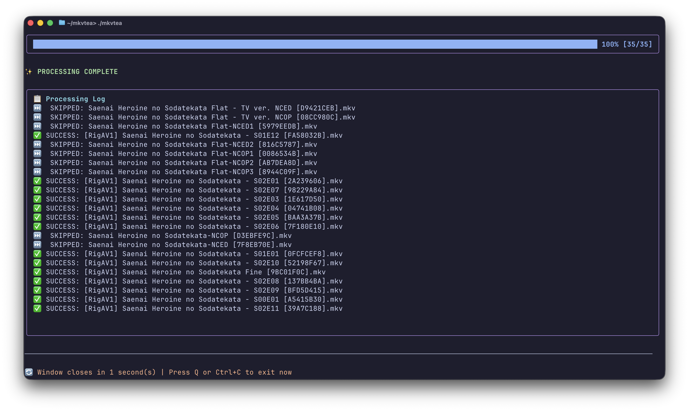

#  MKVTea

> A blazing-fast batch processing tool for managing your Anime/TV Series library with beautiful TUI interface.

[](https://golang.org)
[](LICENSE)
[](#-installation)

##  TUI Interface



> *Screenshot example showing the tool in action with sample anime files*

## ✨ Features

- **🚀 Blazing Fast**: Concurrent processing with customizable worker threads
- **🎨 Beautiful TUI**: Responsive terminal UI with real-time progress tracking
- **📁 Recursive Processing**: Handle massive libraries with one command
- **🎯 Smart Language Selection**: Extract subtitles in any language (ISO 639-2 codes)
- **🔊 Audio Cleaning**: Keep only desired audio language, remove bloat
- **🎬 Directory Mirroring**: Maintains folder structure automatically
- **🎞️ AV1 Encoding**: Batch-encode your library with SVT-AV1-Essential, keeping all audio, subtitles, fonts and chapters
- **✅ Dependency Validation**: Clear error messages if MKVToolNix not installed

## 📋 Requirements

- **Go 1.25+** (for building from source)
- **MKVToolNix** (mkvmerge, mkvextract, mkvpropedit)

### Install MKVToolNix

```bash
# macOS
brew install mkvtoolnix

# Ubuntu/Debian
sudo apt install mkvtoolnix

# Fedora/RHEL
sudo dnf install mkvtoolnix

# Arch Linux
sudo pacman -S mkvtoolnix-cli
```

### Install encoding tools (encode mode only)

The `encode` mode additionally needs **FFmpeg** and **SVT-AV1-Essential** (provides `SvtAv1EncApp`):

```bash
# macOS — Homebrew tap: FFmpeg bundled with SVT-AV1-Essential + the encoder CLI
brew install fraluc06/ffmpeg-svt-av1-essential/ffmpeg
brew install fraluc06/ffmpeg-svt-av1-essential/svt-av1-essential

# Ubuntu/Debian
sudo apt install ffmpeg
# SvtAv1EncApp: build SVT-AV1-Essential from source: https://github.com/nekotrix/SVT-AV1-Essential
```

The [tap](https://github.com/fraluc06/homebrew-ffmpeg-svt-av1-essential) ships standard-named
formulae (`ffmpeg`, `svt-av1`, `ffms2`) that satisfy `depends_on "ffmpeg"`; if you have the
homebrew-core versions installed, Homebrew will ask you to replace them first.

## 🚀 Installation

### From Source

```bash
git clone https://github.com/yourusername/mkvtea.git
cd mkvtea
go build
sudo mv mkvtea /usr/local/bin/  # Optional: add to PATH
```

### Pre-built Binary

Download from [Releases](https://github.com/fraluc06/mkvtea/releases)

## 📖 Usage

### Basic Commands

```bash
# Extract subtitles from current directory
./mkvtea e .

# Extract subtitles recursively
./mkvtea e /path/to/anime -r

# Extract specific language
./mkvtea e /path/to/anime -r -l eng

# Extract multiple languages at once
./mkvtea e /path/to/anime -r -l ita,eng,jpn

# Merge subtitles back
./mkvtea m /path/to/anime -r

# Merge with audio cleaning (keep only Japanese)
./mkvtea m /path/to/anime -r -a jpn

# Encode a whole library to AV1 (results go to a per-folder 'av1' subdir)
./mkvtea en /path/to/anime -r

# Encode with custom SVT-AV1 parameters
./mkvtea en /path/to/anime -r --svtav1-params "crf=30:speed=slow:film-grain=8"

```

### Global Flags

| Flag                    | Short | Default | Description                                                       |
|:------------------------|:-----:|:-------:|-------------------------------------------------------------------|
| `--lang`                | `-l`  |  `ita`  | Subtitle language code(s): single (eng) or multiple (ita,eng,jpn) |
| `--output`              | `-o`  |    -    | Custom output directory                                           |
| `--subs-dir`            | `-s`  |    -    | Custom directory for external subtitles (merge only)              |
| `--recursive`           | `-r`  | `false` | Process all subdirectories                                        |
| `--audio`               | `-a`  |    -    | Keep only this audio language (removes others)                    |
| `--keep-only-audio`     |   -   |    -    | Keep only this audio language (extract/merge/encode)              |
| `--checkpoint-interval` |   -   |  `10`   | Save checkpoint every N files (0 to disable)                      |

### Encode-Only Flags

| Flag                  | Default  | Description                                                          |
|:----------------------|:--------:|----------------------------------------------------------------------|
| `--svtav1-params`     |    -     | FFmpeg-style encoder params: `"crf=30:tune=0:film-grain=8"`          |
| `--av1-params-file`   |    -     | File with one `key=value` per line (`#` comments allowed)            |
| `--out-subdir`        |  `av1`   | Per-folder output subdirectory name                                  |

In encode mode, `-a`, `-s` and `--audio-dir` do not apply.

### Performance Tuning

**Parallel Processing**: MKVTea automatically detects the optimal number of worker threads based on your CPU count:
- Uses **50% of available CPU cores** (e.g., 4 cores → 2 workers)
- Minimum: **2 workers** (for slower systems)
- Maximum: **8 workers** (to avoid overwhelming your system)

> **Encode mode is the exception**: it runs one file at a time by default,
> because `SvtAv1EncApp` already saturates all cores on a single video.

## 💡 Examples of Use

### Extract Italian Subtitles

```bash
./mkvtea e /anime/season1 -r -l ita
```

Creates:
```
/anime/season1/
├── episode01.mkv
├── episode02.mkv
└── subs/ita/
    ├── 01_ita_9.ass
    ├── 02_ita_9.ass
    └── ...
```

### Merge with Audio Cleaning

```bash
./mkvtea m /anime/season1 -r -l ita -a jpn
```

Results in:
- Removes all original subtitles
- Adds Italian subtitles (set as DEFAULT)
- Keeps only Japanese audio
- Creates `/anime/season1_ita/` with processed files

### Merge from Custom Subtitle Directory

```bash
./mkvtea m /anime/episodes -r -l ita -s /external/subs
```

Searches for subtitles in `/external/subs/` instead of default location.

### Encode a Season to AV1

```bash
./mkvtea en /anime/season1 -r --svtav1-params "crf=30:speed=slow:film-grain=8"
```

Creates:
```
/anime/season1/
├── episode01.mkv
├── episode02.mkv
└── av1/
    ├── episode01.mkv   # AV1 video, audio/subs/fonts from the original
    └── episode02.mkv
```

### Resume Interrupted Processing with Checkpoints

Process failed mid-way? Pick up where you left off:

**How checkpoints work:**
- ✅ Saves progress every N files (default: 10)
- 💾 Stores `.mkvtea_checkpoint.json` in target directory
- 🔄 Auto-detects previous checkpoints on next run
- 🗑️ Clear checkpoint and restart: select `n` at prompt
- 🔐 Tracks by filename + MD5 hash (detects renamed files)
- 🎞️ Stored per mode: an interrupted `encode` run resumes independently from extract/merge state
- 🎛️ Stored per mode: an encode resume never mixes with an extract/merge checkpoint

**Example checkpoint file:**
```json
{
  "mode": "extract",
  "languages": ["ita"],
  "directory": "/anime/library",
  "total_files": 1000,
  "started_at": "2025-12-22T10:30:00Z",
  "processed": {
    "successful": 350,
    "failed": 12,
    "skipped": 15
  }
}
```

## 🎞️ AV1 Encoding (encode mode)

`mkvtea encode` re-encodes every video file in a directory to AV1 using
**SVT-AV1-Essential** (`SvtAv1EncApp`), then remuxes the result with all the
original file's non-video streams — audio, subtitles, attached fonts, chapters
and tags are carried over untouched.

**Per-file pipeline** (the Go port of the classic `ffmpeg | SvtAv1EncApp` script):

1. Decode the source to 10-bit y4m with FFmpeg, piped straight into `SvtAv1EncApp`
2. Encode the video track to AV1 (IVF bitstream in a temp file, always cleaned up)
3. Remux: encoded video + every non-video track from the original via `mkvmerge`
4. Write to `<source folder>/av1/<original name>.mkv`

Files already present in `av1/` are **skipped**, so reruns and interrupted
batches are safe. With `-o` the output instead mirrors the library structure
under the given root (like merge mode).

### Encoder parameters

By default mkvtea passes **no parameters**: SVT-AV1-Essential's own defaults
are used. To tune the encoder, three sources are understood, in order of
precedence (the first one present wins; sources never merge):

```
--svtav1-params  >  --av1-params-file  >  .mkvtea-av1-params  >  encoder defaults
```

**1. Command flag** — FFmpeg `-svtav1-params` style, colon-separated `key=value`
pairs (no dashes needed; they're stripped if you type them anyway):

```bash
mkvtea en /anime -r --svtav1-params "crf=30:speed=slow:tune=0:film-grain=8"
```

**2. Explicit file** — `--av1-params-file ./my-params.txt`

**3. Per-folder discovery** — drop a `.mkvtea-av1-params` file inside a series
folder and it applies to that series. For a recursive run, mkvtea searches from
each source file's folder **up to the scan root**: the nearest file wins, so a
library-wide file at the root acts as the default, and any series folder can
override it.

### Parameters file format

```
# SVT-AV1-Essential params for this series
# - one param per line:  key=value   (no dashes, like ffmpeg's -svtav1-params)
# - blank lines and everything after # are ignored
# - flag-style one-liners also work:  crf=30:speed=slow

crf=30
speed=slow
tune=0            # 0=VQ, 1=PSNR, 2=SSIM
film-grain=8      # grain synthesis 1-50
film-grain-denoise=0
```

Notes on accepted tokens:

- A bare key (`enable-restoration`) is passed as a standalone flag
- `i`, `input`, `b`, `output` are reserved (mkvtea owns the pipe) — using them
  is an error, and with a global source (flag or `--av1-params-file`) mkvtea
  fails **before** scanning so you don't burn an hour discovering a typo
- Parse errors from files report the offending line number

### Interplay with the other flags

| Flag                    | Effect in encode mode                                                       |
|:------------------------|:----------------------------------------------------------------------------|
| `-r`                    | Walk subdirectories; `av1/` output folders are never re-scanned             |
| `-o`                    | Output root (structure mirrored); otherwise per-folder `av1/`               |
| `-l` (explicitly given) | Keep only subtitle tracks in those languages (+ `und`); audio untouched     |
| `--keep-only-audio`     | Keep only audio tracks in that language (like merge mode: no match = keep all) |
| `--checkpoint-interval` | Checkpoints work per mode, so an encode run resumes independently           |

Also accepted as inputs: `.mov`, `.avi`, `.m2ts`, `.ts`, `.webm` in addition to
`.mkv`/`.mp4` (output is always `.mkv`).

### Performance & limitations

- **One encode at a time by default**: `SvtAv1EncApp` already saturates the
  machine on its own, so mkvtea runs encode jobs sequentially (use `lp=<n>` in
  your params to cap its internal parallelism if you need the cores for
  something else)
- **HDR is not preserved**: metadata (HDR10/Dolby Vision) doesn't survive the
  y4m pipe; SDR 10-bit sources are fine
- Long-running encodes log per-file results; use `--checkpoint-interval` to make
  interrupted batches resumable

## 🔍 Language Codes

ISO 639-2 three-letter codes:

| Language           | Code  |
|:-------------------|:------|
| Japanese           | `jpn` |
| Italian            | `ita` |
| English            | `eng` |
| German             | `deu` |
| French             | `fra` |
| Spanish            | `spa` |
| Portuguese         | `por` |
| Chinese (Mandarin) | `zho` |
| Korean             | `kor` |
| Russian            | `rus` |

### File Responsibility

- **`cmd/scanner.go`** - Find video files in directories (mode-aware extensions; skips `av1/` output dirs)
- **`mkv/metadata.go`** - Read MKV file metadata (tracks, attachments)
- **`mkv/parser.go`** - Extract episode numbers from filenames
- **`mkv/engine.go`** - Core MKV operations (extract, merge, property editing)
- **`encode/encode.go`** - AV1 pipeline: ffmpeg→SvtAv1EncApp pipe + mkvmerge remux
- **`encode/params.go`** - Parse and resolve SVT-AV1 parameters (flag / file / discovery)
- **`ui/model.go`** - BubbleTea model state + lifecycle (Init, Update)
- **`ui/processing.go`** - Concurrent file processing logic
- **`ui/rendering.go`** - Progress bars and log rendering
- **`ui/view.go`** - TUI display layout
- **`ui/processor.go`** - Entry point for TUI execution

**Design principle**: Each file has a single, clear responsibility (50-150 LOC target)

## 🤝 Contributing

Contributions welcome! Please feel free to:
- Report bugs
- Suggest features
- Submit pull requests

## 🐛 Troubleshooting

### ❌ "No MKV files found"

- Verify path exists
- Check file extensions are `.mkv` (case-insensitive)
- Use `-r` flag for recursive search
- In encode mode the message reads "No video files found" and also accepts `.mp4`, `.mov`, `.avi`, `.m2ts`, `.ts`, `.webm`

### ⏭️ "SKIPPED: filename.mkv"

- Extract/merge: the file doesn't have subtitles in the requested language (normal for opening/ending sequences)
- Encode: the `av1/` output already exists, so the file is left alone (delete it to force a re-encode)

### 🎞️ Encode mode needs more than MKVToolNix

`encode` additionally requires `ffmpeg` and `SvtAv1EncApp` (SVT-AV1-Essential) on your PATH — on macOS both come from the `fraluc06/ffmpeg-svt-av1-essential` tap. See [Install encoding tools](#install-encoding-tools-encode-mode-only). HDR/Dolby Vision metadata is not carried through the y4m pipe, so use SDR sources for now.

## ⚠️ Disclaimers

- Screenshots and examples shown are for demonstration purposes only
- File names and content displayed are sample data to illustrate functionality
- MKVTea is a processing tool designed to work with media files on your system
- Users should only process media files they have the legal right to modify
- This tool does not distribute, stream, or handle copyrighted content - it simply processes local files

##  License

MIT License - see [LICENSE](LICENSE) file

---

Made with ❤️ by [fraluc06](https://github.com/fraluc06)
